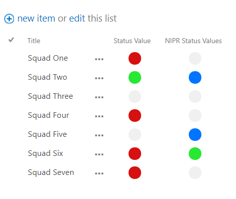
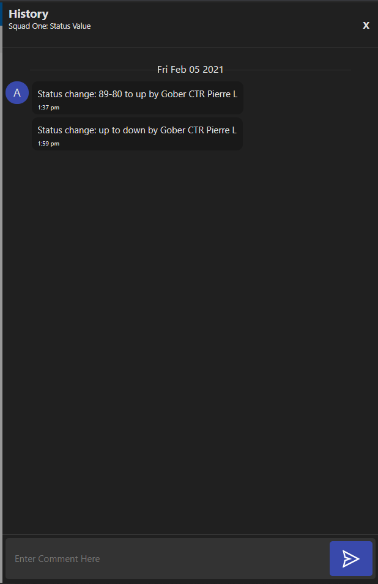

<h1>IMS - Meatball Solution</h1>
<dl>
  <h3>
    <dt>Mission Statement</dt>
  </h3>
  <h4>
    <dd>
      Enable users to rapidy update and visualize a field status to affect
      decision making within an organization.
    </dd>
  </h4>
</dl>
<dl>
  <h3><dt>Table of Contents</dt></h3>
  <h4>
    <dd>
      <table>
        <tr>
          <td><a href="#1">Execution</a></td><td><a href="#2">Features</a></td><td><a href="#3">Customizations</a></td><td><a href="#4">Debugging</a></td>
        </tr>
      </table>
    </dd>
  </h4>
</dl>
<dl>
  <h3>
    <dt id="1">1. Execution</dt>
  </h3>
  <h4>
    <dd>
      The IMS - Meatball solution deploys through the site collection's master
      page. Thus all pages natively run the solution.
    </dd>
    <dd>
      The runtime enviornment requires jQuery, specifically Ajax, to function.
      Most DoD SharePoint environments load jQuery to support other solutions.
      Please edit the master page to confirm its reference.
    </dd>
  </h4>
  <h3>
    <dt id="2">2. Features</dt>
  </h3>
  <h4>
    <dd>
      <ul>
        <li>
          All select list values, by default, will be replaced with circles of
          different colors.
           
          
           
        </li>
        <li>
          A popover appears when you mouse over the circle.
           
          
           
        </li>
        <li>
          The popover displays the column and row name, all available choices
          for the cell, the currently selected value, the last history change
          made, and a show more button. Clicking on any choice will update the
          list and page in real time.
           
          
           
        </li>
        <li>
          Clicking on show more, will open a history panel.
           
          
           
        </li>
        <li>
          It displays all historical changes, and comments made for that
          particular cell. An input area at the bottom of the history panel
          allows for custom comments to be made.
           
          
           
        </li>
        <li>
           The history feature allows users to track changes over time, and attach reasons for said change.  For example, why the production status shifted from green to yellow.            Thus reduces time needed for decisions to be made.
        </li>
      </ul>
    </dd>
  </h4>
  <h3>
    <dt id="3">3. Customizations</dt>
  </h3>
  <h4>
    <dd>
      Table of Contents
      <table>
        <tr>
          <td>
            <a href="#1c">Defaults</a>
          </td>
          <td>
            <a href="#2c">Example</a>
          </td>
          <td>
            <a href="#3c">Colors and Values</a>
          </td>
          <td>
            <a href="#4c">Ignore</a>
          </td>
          <td>
            <a href="#5c">Text</a>
          </td>
          <td>
            <a href="#6c">Disable</a>
          </td>
        </tr>
      </table>
    </dd>
  </h4>
  <dd>
    <ul>
      <li>
        <h4 id="1c">Defaults</h4>
        <h5>
          The script will replace text in any select list with a circle of a
          known color.  
          If the text isn't a default value, then a circle of the background
          color will appear.  
          The default values are:
          <table>
            <tr>
              <td>
                Text
              </td>
              <td>
                Color
              </td>
            </tr>
            <tr>
              <td>Up</td>
              <td>Green</td>
            </tr>            
            <tr>
              <td>Down</td>
              <td>Red</td>
            </tr>            
            <tr>
              <td>Degraded</td>
              <td>Yellow</td>
            </tr>            
            <tr>
              <td>NA</td>
              <td>Inherit</td>
            </tr>            
            <tr>
              <td>100-90</td>
              <td>Green</td>
            </tr>            
            <tr>
              <td>89-79</td>
              <td>Yellow</td>
            </tr>            
            <tr>
              <td>79-10</td>
              <td>Red</td>
            </tr>            
            <tr>
              <td><79 </td>
              <td>Red</td>
            </tr>
            <tr>
              <td><10 </td>
              <td>Blue</td>
            </tr>
          </table>
        </h5>
      </li>
      <li>
        <h4 id="2c">
          Example Customization Code
        </h4>
        <pre>
          <code>
            
          </code>
        </pre>
      </li>
      <li>
        <h4 id="3c">Colors and Values</h4>
        <h5>
          To add custom values:
          <ol>
            <li>
              Add a script editor to the page, or use one on the page.
            </li>
            <li>
              Write the following inside the script editor:
               
              <pre>
                <code>
                  
                </code>
              </pre>
            </li>
            <li>
              The values must line up with the custom values. The colors can be
              words or # code.
              <a href="http://colorcode.is/">Color Code</a> can be helpful here.
            </li>
            <li>
              Example: 
              <pre>
              <code>
              
              </code>
              </pre>
            </li>
          </ol>
        </h5>
      </li>
      <li>
        <h4  id="4c">Ignore Columns</h4>
        <h5>
          To set columns to be ignored:
          <ol>
            <li>
              Add a script editor to the page or use one on the page.
            </li>
            <li>
              Write the following into the script editor
              <pre>
              <code>
              
              </code>
              </pre>
            </li>
            <li>
              Inside of the array, add in the name of the column to be ignored.
            </li>
            <li>
              Example:
               
              Column name: "Test Column"
               
              <pre>
              <code>
              
              </code>
              </pre>
            </li>
          </ol>
        </h5>
      </li>
      <li>
        <h4  id="5c">Text Columns</h4>
        <h5>
          To set columns to display text instead of a meatball:
          <ol>
            <li>
              Add a script editor to the page or use one on the page.
            </li>
            <li>
              Write the following into the script editor
              <pre>
              <code>
              
              </code>
              </pre>
            </li>
            <li>
              Inside of the array, add in the name of the column to be ignored.
            </li>
            <li>
              Example:
               
              Column name: "Test Column"
              <pre>
              <code>
              
              </code>
              </pre>
            </li>
          </ol>
        </h5>
      </li>
      <li>
        <h4  id="6c">Disable Script</h4>
        <h5>
          To disable the script from running:
          <ol>
            <li>
              Add a script editor to the page or use one on the page.
            </li>
            <li>
              Write the following into the script editor
              <pre>
              <code>
              
              </code>
              </pre>
            </li>
          </ol>
        </h5>
      </li>
    </ul>
  </dd>
  <h4><dt id="4">4. Debugging</dt></h4>
  <h5>
    <dd>
      The following should help fix most issues with the script.
      <ol>
        <li>
          Check the page's lists.  Ensure the proper lists are all select lists.
        </li>
        <li>
          Verify internal and external names for each column.  The solution uses the internal column names for information transfer, and the external column name for visual                 changes.
        </li>
        <li>
          Verify column names haven't been changed.  If the external names change, then the values in the <a href="#3">customization</a> script will not run correctly.
        </li>
        <li>
          Verify the values in each select column and ensure they match with
          defaults or overrides.  If the <a href="#3c">colors and values</a> script lacks or contains incorrect values, then the meatballs will revert to inheriting the color from the page.  For example, a black page will cause black meatballs.
        </li>
        <li>
          If error persists, then contact the developers.
        </li>
      </ol>
    </dd>
    <dd>
      For Developers
      <ol>
        <li>
          Add a script editor to the page or use one on the page.
        </li>
        <li>
          Write the following into the script editor
          <pre>
          <code>
          
          </code>
          </pre>
          Now, any error will appear on a notification design to remain on the
          page no matter what.
        </li>
        <li>
          To turn off debug mode, either delete { var meatball_debug = true; }
          or change it to { var meatball_debug = false }
        </li>
      </ol>
    </dd>
  </h5>
</dl>
